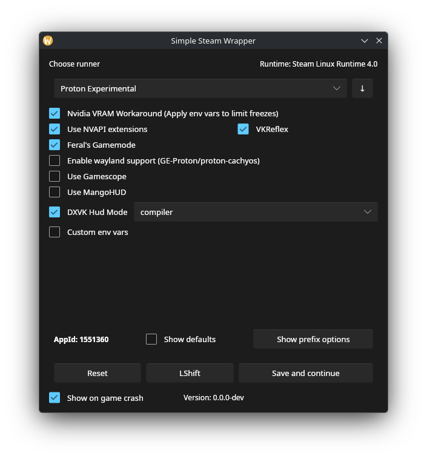

# Simple Steam Wrapper
### A rust proton wrapper inspired by SteamTinkerLaunch designed to be as out of your way as possible

## Why

I had a lot of issues with my games using proton and all, and editing the command line from steam everytime I wanted to test something was starting to weigh on me.
I wanted a tool to help me with this but not show up when I don't need it.\
I also wanted to try out rust, hence why the code can sometime look overengineered or not right.

## Features

- A download manager (supports only proton-cachyos and GE-Proton, but could be expanded easily)
- Auto discovery of steam compat tools (like Proton Experimental)
- An easy to use GUI
- GPU selection (that even works for multiple Nvidia GPUs inside the same system)
- Uses the required runtime from the compatibility tool
- Run winetricks in prefixes

## Tools used
- Slint (GUI using Winit and Skia for portability)

## How to use
This tool is made to be used as a default Steam Compatibility Tool, and when a game doesn't work, you simply can keep 'Left Shift' (by default, can be changed but not many keys are supported because of udev rules) to open the GUI.\
Clicking 'Save and continue' or 'Save and quit' will save the configuration at `~/.config/simplesteamwrapper/config.yaml` and will remember settings per game.

## How to install
Simply download the last release, start it, either click 'Yes' when asked for installation, or click 'Update wrapper" from the main window.

